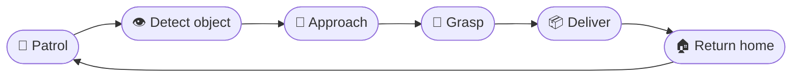
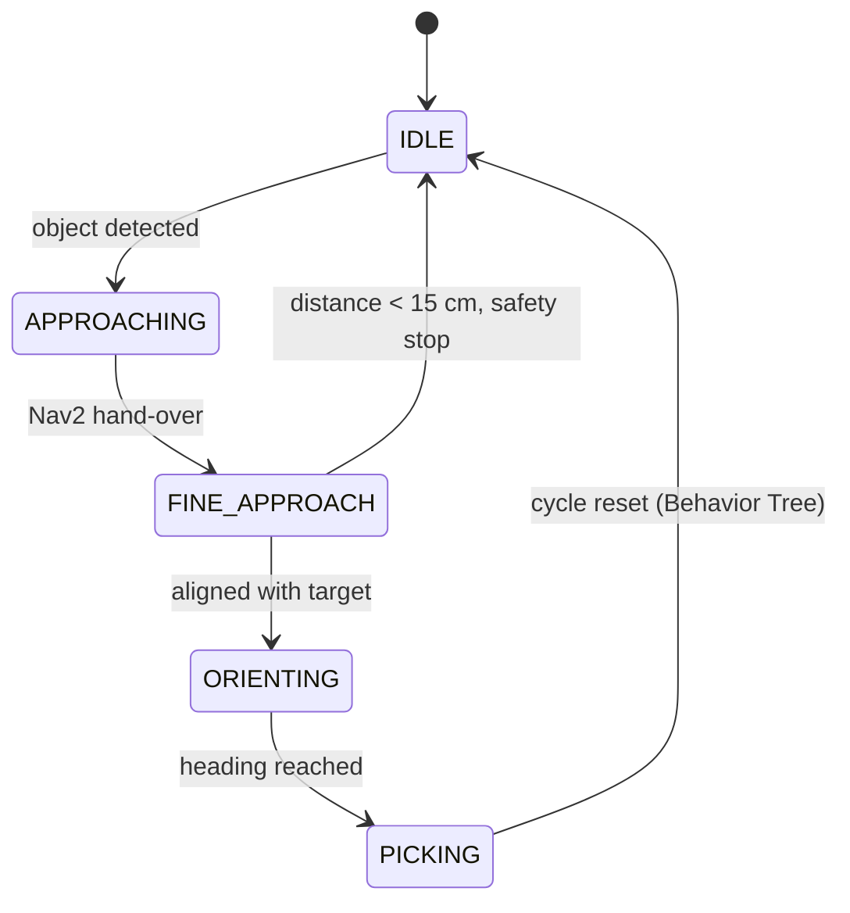
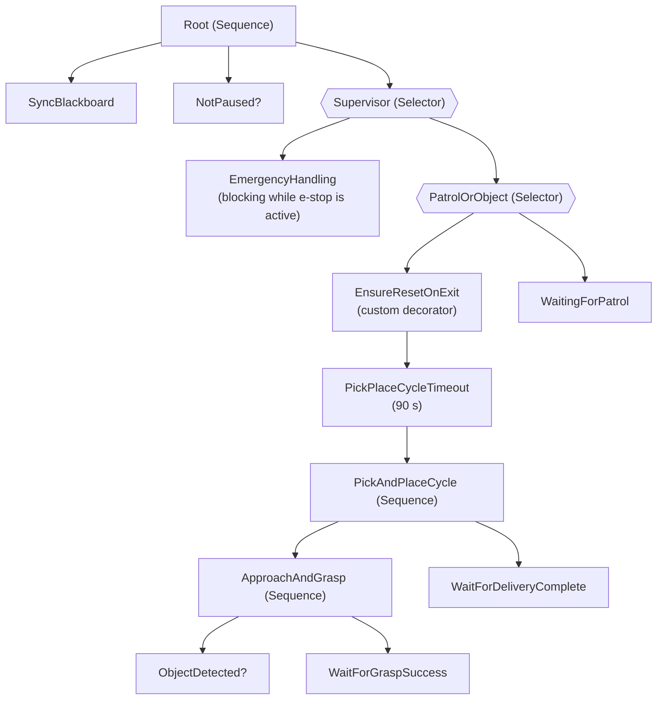

<div align="center">

# 🤖 TurtleBot3 Autonomous Pick & Place

### Mobile manipulation orchestrated by a Behavior Tree
**ROS 2 Humble · Nav2 · MoveIt · Gazebo · py_trees**

[](https://github.com/Adim-Jebali/turtlebot3_pick_and_place/releases/latest)


*Patrol → Detect → Approach → Grasp → Deliver → Return → Resume — fully autonomous and repeatable.*

</div>

---

## 📥 Download

> **The complete project is available for download.**

<div align="center">

### [⬇️ Download the full project (V1.0)](https://github.com/Adim-Jebali/turtlebot3_pick_and_place/releases/tag/V1.0)

</div>

| Option | How | Best for |
|---|---|---|
| **📦 Release archive** | Open the [Releases page](https://github.com/Adim-Jebali/turtlebot3_pick_and_place/releases/latest) and download the `.zip` listed under **Assets** | Getting the complete project in one click |
| **🔽 Git clone** | `git clone https://github.com/Adim-Jebali/turtlebot3_pick_and_place.git` | Developers who want the repository and its history |

---

## 🧭 Table of Contents

1. [Project at a Glance](#-project-at-a-glance)
2. [Demo](#-demo)
3. [Overview & Highlights](#-overview--highlights)
4. [Mission Workflow](#-mission-workflow)
5. [System Architecture](#️-system-architecture)
6. [Behavior Tree Orchestration](#-behavior-tree-orchestration)
7. [Supervision Dashboard](#️-supervision-dashboard)
8. [Tech Stack](#-tech-stack)
9. [Getting Started](#-getting-started)
10. [Testing & Validation](#-testing--validation)
11. [Repository Structure](#-repository-structure)
12. [Author & Acknowledgements](#-author--acknowledgements)
13. [References](#-references)

---

## 📋 Project at a Glance

| | |
|---|---|
| **Context** | Engineering internship project, **Enova Robotics** (Novation City, Sousse, Tunisia) |
| **Period** | 15 June 2026 – 15 July 2026 |
| **Goal** | Integrated control system for navigation, object localization and pick-and-place on a mobile manipulator |
| **Platform** | TurtleBot3 + OpenMANIPULATOR-X (simulated) |
| **Middleware** | ROS 2 Humble on Ubuntu |
| **Core contribution** | Behavior Tree orchestration layer for robust, autonomous multi-cycle missions |
| **Status** | ✅ Validated in Gazebo simulation · 🔜 Physical robot deployment planned |
| **Language** | Python 3 |

---

## 🎬 Demo
> 📹 **Full pipeline demo
> 

https://github.com/user-attachments/assets/06b1517a-dafa-403e-9ce8-0d41b9eaabdf


## ✨ Overview & Highlights

This project implements a **complete autonomous pick-and-place pipeline**. The robot patrols a known environment, detects a target object with its onboard camera, approaches it precisely, grasps it, carries it to a drop-off point, releases it, returns home and **resumes patrolling with no human intervention**.

Its main design contribution is a **Behavior Tree** orchestration layer that replaced an initial, implicit coordination between nodes. The mission logic becomes explicit, recoverable after failures and easy to visualize.

| Capability | Details |
|---|---|
| 🧭 **Autonomous patrol** | 7 waypoints through Nav2 (`NavigateToPose`) |
| 👁️ **Object localization** | HSV segmentation + TF2 triangulation into the `map` frame |
| 🎯 **Two-stage approach** | Coarse Nav2 navigation, then fine visual servoing with a **15 cm** safety stop |
| 🦾 **Reliable grasping** | 4-DOF arm and gripper, attachment signaled only after confirmed gripper closure |
| 🌳 **Behavior Tree** | Emergency-stop priority, **90 s** cycle timeout, guaranteed reset on exit |
| 🖥️ **Dashboard** | Live status, camera feed, manual control, one-click launch of the full simulation |
| 🔁 **Repeatable cycles** | Automatic cycle reset after each successful drop-off |

---

## 🔄 Mission Workflow



1. **Patrol** a known environment along predefined waypoints
2. **Detect and localize** the target object with the onboard camera
3. **Approach** it precisely and safely
4. **Grasp** it with the manipulator arm
5. **Carry** it to a defined drop-off point
6. **Release** it, then back off safely
7. **Resume** the patrol autonomously

---

## 🏗️ System Architecture

The system is a set of **independent ROS 2 nodes** communicating exclusively through standard ROS 2 mechanisms (topics, services, actions). This loose coupling keeps it modular, maintainable and easy to extend.

<div align="center">


*ROS 2 node and topic graph (`rqt_graph`)*

</div>

### Nodes

| Node | Layer | Responsibility |
|---|---|---|
| `yolo_detector` | Perception | Camera processing (HSV segmentation), 3D object position via TF2 triangulation, publishes pose and angular offset |
| `nav_controller` | Navigation | Cyclic patrol through 7 waypoints, return home, emergency stop. Exposes ROS 2 services |
| `approach_controller` | Approach | Hand-over from Nav2 to fine visual servoing, final orientation before grasp (state machine) |
| `arm_controller` | Manipulation | Arm trajectories and gripper (`GripperCommand` action) for grasp and release |
| `object_attacher` | Simulation | Creates / removes a rigid joint between gripper and object in Gazebo (`IFRA_LinkAttacher`) |
| `place_controller` | Drop-off | Open-loop navigation to the drop point, release, safety back-off, return-home trigger |
| `mission_bt_orchestrator` | Orchestration | Behavior Tree coordinating the whole mission cycle |
| `nav_dashboard` | Supervision | PyQt5 GUI for monitoring, manual control and centralized launch |

### Approach state machine



---

## 🌳 Behavior Tree Orchestration

Coordination between nodes was first implicit, each node reacting to the others' state changes. It allowed quick prototyping but had three limits: **no recovery after failure**, **decision logic scattered across several files**, and **no global view of the mission state**. The Behavior Tree addresses all three.



| Design property | Effect |
|---|---|
| 🚨 **Emergency stop first** | Evaluated before anything else at every tick |
| ⏱️ **Timeout decorator (90 s)** | Protects the full approach → grasp → deliver sequence |
| ♻️ **Reset decorator** | Puts every controller back to idle when leaving the object branch, on success *or* failure |
| 🔁 **Automatic cycle reset** | Chains several missions without manual restart |

---

## 🖥️ Supervision Dashboard

The PyQt5 dashboard (`nav_dashboard`) centralizes control and monitoring:

- Real-time patrol status and active Behavior Tree phase
- Live onboard camera feed
- **Start patrol**, **Return home**, **Emergency stop**
- One-click launch of the **whole simulation stack**: Gazebo, Nav2, MoveIt, object spawn, application nodes, orchestrator
- Process shutdown and orphan cleanup

This lets a non-developer operator run the system.

<div align="center">


</div>

---

## 🧰 Tech Stack

| Domain | Tools |
|---|---|
| Middleware | **ROS 2 Humble Hawksbill** (LTS), Ubuntu |
| Simulation | **Gazebo**, `IFRA_LinkAttacher` plugin, RViz2 |
| Navigation | **Nav2** (AMCL, path planning, obstacle avoidance) |
| Manipulation | **MoveIt**, OpenMANIPULATOR-X |
| Perception | **OpenCV** (HSV segmentation), **TF2** |
| Orchestration | **py_trees / py_trees_ros** |
| Supervision UI | **PyQt5** |
| Language | **Python 3** |
| Tooling | Git |

---

## 🚀 Getting Started

### 1. Get the project

Pick one of the options from the [Download](#-download) section: the release archive, or

```bash
git clone https://github.com/Adim-Jebali/turtlebot3_pick_and_place.git
```

### 2. Prerequisites

| Requirement | Notes |
|---|---|
| Ubuntu 22.04 + **ROS 2 Humble** | |
| Gazebo, **Nav2**, **MoveIt 2** | |
| TurtleBot3 and OpenMANIPULATOR-X packages | ROS 2 Humble versions |
| `IFRA_LinkAttacher` Gazebo plugin | Used to simulate grasping |
| Python packages | `opencv-python`, `PyQt5`, `py_trees`, `py_trees_ros` |

```bash
sudo apt install ros-humble-navigation2 ros-humble-nav2-bringup \
                 ros-humble-moveit ros-humble-turtlebot3* \
                 ros-humble-py-trees ros-humble-py-trees-ros
pip install opencv-python PyQt5
```

### 3. Build

```bash
mkdir -p ~/turtlebot3_ws/src
# place the package in ~/turtlebot3_ws/src (clone it here or extract the release archive)
cd ~/turtlebot3_ws
rosdep install --from-paths src --ignore-src -r -y
colcon build --symlink-install
source install/setup.bash
```

### 4. Run

<!-- TODO: adapt the command below to your exact entry point / launch files. -->

```bash
ros2 run turtlebot3_pick_and_place nav_dashboard
```

Then use the dashboard buttons in this order:

**Gazebo → Nav2 → MoveIt → Spawn object → Application nodes → Behavior Tree → Start patrol**

---

## 🧪 Testing & Validation

The system was validated incrementally, subsystem by subsystem, then through full integration tests in Gazebo with systematic analysis of ROS 2 logs.

| # | Issue | Root cause | Fix |
|---|---|---|---|
| 1 | Intermittent freeze during final orientation | Object left the camera field of view while rotating, so the centering condition was never met | Detection **freshness criterion** + safety timeout |
| 2 | `AttributeError` during post-drop back-off | Uninitialized attributes | Full initialization of back-off parameters and velocity publisher |
| 3 | System stuck after the first full cycle | Approach node frozen in its final state | **Cycle-reset topic** driven by the Behavior Tree |
| 4 | Erratic robot during coarse approach | A new Nav2 goal sent at every detection (up to 30 Hz), so the planner never completed a trajectory | **Rate limiting**: new goal only if the target moved significantly or after a minimum delay |

**Result:** the full cycle *patrol → detection → approach → grasp → delivery → return → patrol resume* runs **autonomously and repeatably** in simulation.

---

## 📁 Repository Structure

<!-- TODO: adjust to your real tree (run `tree -L 2` in the package folder). -->

```text
turtlebot3_pick_and_place/
├── turtlebot3_pick_and_place/     # Python nodes (perception, navigation, approach, arm, ...)
├── launch/                        # Launch files
├── config/                        # Waypoints and parameters
├── worlds/ models/                # Gazebo world and object models
├── docs/images/                   # Figures used in this README
├── package.xml
├── setup.py
└── README.md
```

---

## 👤 Author & Acknowledgements

**Adim Jebali**
Mechatronics Engineering student · Mobile robotics & autonomous systems


**Thanks to**
- **Enova Robotics** for hosting the internship and the opportunity to work on a real mobile-robotics problem
- The open-source communities behind **ROS 2, Nav2, MoveIt, py_trees, OpenCV** and **ROBOTIS TurtleBot3**

---

## 📚 References

1. Open Robotics, [ROS 2 Humble Documentation](https://docs.ros.org/en/humble/)
2. Open Navigation, [Nav2 Documentation](https://docs.nav2.org/)
3. PickNik Robotics, [MoveIt Documentation](https://moveit.picknik.ai/)
4. D. Colledanchise & P. Ögren, *Behavior Trees in Robotics and AI: An Introduction*, CRC Press, 2018
5. [py_trees Documentation](https://py-trees.readthedocs.io/)
6. ROBOTIS, [TurtleBot3 e-Manual](https://emanual.robotis.com/docs/en/platform/turtlebot3/overview/)
7. [OpenCV Documentation](https://docs.opencv.org/)

<div align="center">

⭐ *If you find this project useful, consider giving it a star.*

</div>
